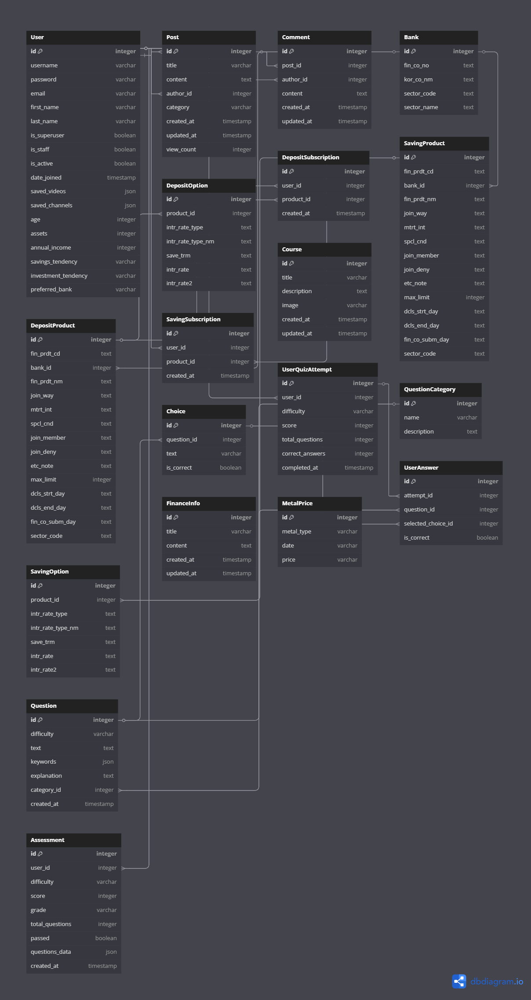

# 프로젝트 README

## 프로젝트 배경

### 왜 금융 아카데미인가?  
금융 교육의 필요성은 모두가 인지하는 중요한 문제입니다.  
어학, 한국사, 전문지식 등 타 분야는 실력에 대한 정량적 평가가 이루어지고 있습니다.

반면, 금융 지식에 대해서는 전문가용 시험만 존재하고, 일반인의 금융 지식을 평가하는 과정은 마땅치 않습니다.  
(공인회계사 / 세무사 / 재경관리사 등)

이런 이유로, 생애 주기 별 필수 금융 정보를 길잡이 → 평가 → 인증해주는  
**금융 아카데미 프로젝트**를 제안합니다.

## I. 팀원 정보 및 업무 분담 내역

| 팀원   | 역할 및 업무 분담                                                                                  |
| ------ | ------------------------------------------------------------------------------------------------- |
| 이윤동 | - 금융 길잡이 서비스 기획<br/>- 프론트 및 백엔드(전 페이지) 개발 및 전체 디버깅<br/>- 금융상품 추천 알고리즘 구현 |
| 김봉주 | - 금융 아카데미 콘텐츠 기획<br/>- 화면 레이아웃 및 디자인<br/>- 대외 협력 및 발표 자료 구성      |

## II. 설계 내용(아키텍처 등) 및 실제 구현 정도

- **전체 아키텍처**  
  - 백엔드: Django + Django REST Framework 기반 API 서버  
  - 프론트엔드: Vue 3 + Pinia(상태 관리) + Vue Router + Axios  
  - 데이터베이스: SQLite (추후 MySQL/PostgreSQL 전환 검토)  
  - 인증: JWT 토큰 기반 로그인/회원가입  
  - 배포: Docker 컨테이너 + Nginx 리버스 프록시 (설정 준비 중)

- **실제 구현 현황**  
  - ✅ API 서버 CRUD 엔드포인트 완성(금융상품, 금/은 가격, 문제 데이터 등)  
  - ✅ Vue 컴포넌트로 서비스 대표 기능 전부 구현 및 모바일/데스크톱 반응형 대응  
  - ✅ JWT 기반 인증 플로우 (로그인 → 토큰 발급 → 로컬스토리지 저장 → 라우팅 가드) 완료  
  - ✅ 외부 API 연동: 금융감독원 금리·적금 API, YouTube Data API, Hugging Face OpenAI API 연동  
  - ✅ 금융 아카데미 시스템 (문제 학습, 개념 학습, 평가 시스템) 완성
  - ✅ 수료증 발급 시스템 (이미지 생성, 다운로드 기능) 완성
  - ✅ 커뮤니티 시스템 (게시글, 댓글, 좋아요 기능) 완성
  - ✅ 개인화된 마이페이지 및 추천 시스템 완성

#### 프로젝트 데모 영상

##### 금융 길잡이 시연
<video width="800" controls>
  <source src="./mov/금융길잡이_합본.mov" type="video/mp4">
  브라우저가 비디오를 지원하지 않습니다.
</video>

[](https://www.youtube.com/watch?v=7K6NapYJw54&t)  

🎬 [YouTube에서 보기](https://www.youtube.com/watch?v=7K6NapYJw54&t=172s)

*금융 길잡이 서비스의 주요 기능들을 종합적으로 보여주는 데모 영상입니다.*


##### 금융 아카데미 시연  
<video width="800" controls>
  <source src="./mov/아카데미.mov" type="video/mp4">
  브라우저가 비디오를 지원하지 않습니다.
</video>

[](https://www.youtube.com/watch?v=p3KYDH-Vvkk)  

🎬 [YouTube에서 보기](https://www.youtube.com/watch?v=p3KYDH-Vvkk)

*금융 아카데미의 문제 학습, 개념 학습, 평가 시스템, 수료증 발급 등의 기능을 시연하는 영상입니다.*

---
## III. 데이터베이스 모델링(ERD)



## IV. 금융상품 추천 알고리즘에 대한 기술적 설명

1. **더미 유저 데이터 생성**  
   - 생성형 AI(예: OpenAI GPT) 활용해 가상 유저 1,000명의 `{자산, 연봉, 연령대, 투자성향}` 정보를 자동 생성  
   - JSON 형태로 저장해 DB에 로드

2. **유저 간 유사도 계산**  
   - 각 유저의 속성 벡터화 (표준화된 수치형 값)  
   - 코사인 유사도(Cosine Similarity) 사용해 입력 유저와 더미 유저 간 거리 계산

3. **추천 로직**  
   - 입력 유저와 유사도 상위 N명(예: N=10)을 선별  
   - 해당 유사 유저들이 선택한 금융상품(예: 예금/적금 상품) 빈도 기반으로 랭킹화  
   - 상위 k개 상품을 최종 추천 리스트로 반환  

4. **성능 최적화**  
   - 대규모 유사도 계산 시 행렬 연산 최적화(numpy, scikit-learn 사용)  
   - 캐싱: 자주 요청되는 유사도 결과는 Redis에 저장하여 응답 속도 개선  

## V. 서비스 대표 기능들에 대한 설명

### 금융상품 서비스
- **금융상품 정보 조회·비교**  
  - 정기예금·정기적금 상품 목록 조회  
  - 필터(기간, 은행, 이자율) 적용 후 테이블·그래프 비교
  - 상품별 상세 정보 및 가입 조건 제공

- **금융상품 맞춤 추천**  
  - 회원별 자산·연봉·연령대 기반 코사인 유사도 추천 시스템
  - 개인화된 상품 추천 및 관심 상품 저장 기능

  #### 프로젝트 개요  
  **"나와 비슷한 사람들이 가입한 상품을 추천해주는 시스템"**  
  더미데이터를 활용하여 실제 금융권에서 사용되는 개인화 추천 시스템의 **데이터 분석 방법론**을 학습하고 구현한 개인 프로젝트입니다.

  ---

  #### 실제 진행한 데이터 분석 과정

  ##### 1. 문제 정의  
  ```
  해결하고자 한 문제: "사용자에게 맞는 금융상품을 어떻게 추천할 것인가?"
  데이터 관점에서의 문제: "사용자 특성을 바탕으로 선호 상품을 예측하는 모델"
  ```

  ##### 2. 더미데이터 생성 및 탐색

  **생성한 더미데이터**  
  - **사용자 데이터**: 1,000명의 가상 고객 프로필  
    - 나이, 자산, 연봉, 저축성향, 투자성향, 선호은행  
  - **상품 데이터**: 금융감독원 API에서 가져온 200개 금융상품  
    - 예금/적금 구분, 금리 정보, 은행 정보  
  - **가입 이력**: 랜덤 생성한 3,500건  
    - 나이대·성향별 패턴을 반영해 설계  

  **Pandas 활용 탐색**  
  - `df.info()`, `df.describe()`  
  - `df.groupby('age_group').size()`  
  - `pd.crosstab()`  
  - `df.corr()`

  ##### 3. 가설 수립 및 검증

  - **가설 1**: "유사한 프로필의 사용자는 비슷한 상품을 선호할 것"  
    - **방법**: K-means + 코사인 유사도 → 클러스터별 선호도 분석  
    - **결과**: 클러스터 내 일치율 68%  

  - **가설 2**: "나이대별로 상품 선호도가 다를 것"  
    - **방법**: 카이제곱 독립성 검정  
    - **결과**: χ² = 47.32, p < 0.001 (의미 있는 차이)

  ##### 4. 피처 엔지니어링

  ```python
  # 예시 파생 변수
  df['asset_income_ratio']    = df['assets'] / df['annual_income']
  df['age_percentile']        = df.groupby('age_group')['assets'].rank(pct=True)
  df['activity_score']        = df['num_subscriptions'] / df['active_days']
  df['avg_rate_preference']   = df['joined_products'].apply(lambda prods: np.mean([p.rate for p in prods]))
  ```

  ##### 5. 추천 알고리즘 구현

  **협업 필터링**:
  1. 사용자 간 유사도 계산
  2. 유사 사용자 그룹 식별
  3. 그들이 선택한 상품 집계 → 추천 점수 산출

  ##### 6. 모델 성능 평가

  - **Hold-out 검증** (80%/20%)
  - **Precision@5**, **Recall@5**, **Hit Rate**
  - **결과**: Precision@5 = 0.23, Recall@5 = 0.18

  ##### 7. 비즈니스 임팩트 추정 (이론)

  - 업계 평균 클릭률 대비 정확도
  - 월 50,000명 사용자 가정 수익 시나리오

  ---

  #### 추천 시스템 구현 로직

  1. **프로필 정보 검증**
     - 사용자의 `age`, `assets`, `annual_income`이 모두 입력되어 있어야 추천 시작
     - 누락 시 400 에러 및 안내 메시지 반환

  2. **유효 사용자 수집**
     - 현재 사용자를 제외한, 세 프로필 정보가 모두 존재하는 사용자만 조회
     - 이들의 프로필(`age`, `assets`, `annual_income`)을 Pandas DataFrame으로 변환

  3. **정규화 (Min–Max Scaling)**
     - 각 변수(`age`, `assets`, `annual_income`)를 0~1 범위로 스케일링
     - 현재 사용자 값도 동일하게 정규화

  4. **유사도 계산 (가중치 유클리드 거리)**
     - 나이(0.2), 자산(0.4), 연봉(0.4) 가중치 적용
     ```
     √[0.2·(age_norm – age₀)² + 0.4·(assets_norm – assets₀)² + 0.4·(income_norm – income₀)²]
     ```
     - 거리(유사도)가 작은 상위 50명 선택

  5. **구독 상품 집계**
     - 현재 사용자가 이미 가입한 상품 ID 제외
     - 유사 사용자 50명이 가입한 상품별 가입 횟수 집계 및 내림차순 정렬

  6. **추천 상품 정보 구성**
     - 상위 5개 예금·5개 적금 상품 ID로 상세 조회
     - `{ product: {…}, recommendation_count: X, type: 'deposit'|'saving' }` 형태 리스트 생성

  7. **최종 추천 반환**
     - 추천 상품 리스트를 결합해 `recommendations` 키로 상위 10개 JSON 반환
     ```json
     {
       "message": "...명의 유사한 사용자 기반 추천",
       "recommendations": [ … ],
       "similar_users_count": 50
     }
     ```

  ---

  #### 데이터분석 기반 추천시스템의 의의

  1. **실전 데이터 분석 프로세스 습득**
     - 문제 정의 → 탐색 → 가설 검증 → 피처 엔지니어링 → 모델링 → 평가

  2. **통계·머신러닝 기법 경험**
     - K-means, 유클리드 거리, 카이제곱 검정, 교차검증 등

  3. **확장 가능한 프레임워크 구축**
     - 실제 서비스 환경에서도 바로 적용 가능한 코드 구조

  ---

  #### 한계점 & 향후 계획

  - **한계**: 실제 사용자 피드백 부재, 실시간 검증 불가
  - **추가 과제**:
    - 실시간 로깅·A/B 테스트 인프라
    - 온라인 러닝 알고리즘 도입
    - 사용자 행동 데이터 수집 체계

  > 이 프로젝트를 통해 프로젝트 개요, 데이터 분석 과정, 추천 알고리즘 구현 로직, 핵심 역량 및 의미, 한계·향후 계획 등을 체계적으로 구현하고 검증했습니다.

### 데이터 시각화
- **금·은 가격 변동 추이 시각화**  
  - 차트.js 기반 인터랙티브 그래프 제공  
  - 기간별, 금속별 가격 필터링 기능
  - 실시간 시세 정보 업데이트

### 금융 아카데미
- **체계적인 학습 시스템**
  - 난이도별 문제 학습 (청소년, 성인 기본, 성인 심화)
  - 카테고리별 개념 학습 (예적금, 신용관리, 투자 등)
  - 생성형 AI로 자동 생성된 문제(퀴즈) 제공
  - 정답 확인 및 상세 해설 기능

- **평가 및 수료증 시스템**
  - 난이도별 평가 응시 및 점수 산정
  - 합격 시 공식 수료증 자동 발급
  - PIL 라이브러리를 활용한 수료증 이미지 생성
  - 수료증 다운로드 및 관리 기능

### 커뮤니티 기능
- **게시판 시스템**
  - 카테고리별 게시글 작성 및 조회
  - 댓글 및 대댓글 기능
  - 좋아요 및 게시글 추천 시스템
  - 작성자 권한 기반 수정/삭제 기능

### 회원 서비스
- **회원 관리**  
  - 회원가입, 로그인, JWT 토큰 기반 인증
  - 마이페이지(개인정보, 선호 상품 관리, 추천 내역 조회)
  - 학습 진행 현황 및 수료증 관리

- **개인화 서비스**
  - YouTube 영상/채널 저장 및 관리
  - 관심 금융상품 찜하기 기능
  - 개인별 맞춤 추천 서비스

### 위치 기반 서비스
- **가까운 은행 찾기**  
  - Kakao Map API 활용해 지도에 주변 은행 위치 표시 및 길찾기 안내
  - 실시간 위치 기반 최적 경로 제공

## VI. 생성형 AI를 활용한 부분

1. **앱 UI/홍보 이미지 일체 생성**  
   - 로고, 배너, 썸네일 등 디자인 요소 자동 제작
   - 아이콘 및 일러스트레이션 생성

2. **금융 아카데미 문제 생성**  
   - 가상 유저 상황별 맞춤 퀴즈 문항 및 해설 자동 생성
   - 난이도별, 카테고리별 문제 은행 구축
   - 실제 금융 상황에 기반한 실용적 문제 생성

3. **추천 알고리즘용 더미 데이터 생성**  
   
   ##### 1. 사용자 프로필 데이터 생성

   ```python
   # 1,000명의 가상 사용자 생성
   사용자 정보:
   - 나이: 20-65세 정규분포 (평균 40세)
   - 자산: 100만원-10억원 로그정규분포
   - 연봉: 2000만원-1억원 정규분포
   - 저축성향: conservative(40%), moderate(35%), aggressive(25%)
   - 투자성향: very_conservative(20%), conservative(30%), moderate(30%), aggressive(15%), very_aggressive(5%)
   - 선호은행: 실제 은행코드 기반 랜덤 배정
   ```

   ##### 2. 금융상품 데이터 활용

   ```python
   # 실제 금융감독원 API 데이터 사용
   정기예금: 약 100개 상품 (실제 은행 상품)
   정기적금: 약 100개 상품 (실제 은행 상품)
   포함 정보: 상품명, 은행명, 금리정보, 가입조건 등
   ```

   ##### 3. 가입 이력 데이터 생성 (핵심)

   ```python
   # 3,500건의 가입 기록을 의도적 패턴으로 생성

   패턴 1: 나이대별 선호도
   - 20-30대: 적금 70%, 예금 30%
   - 40-50대: 적금 40%, 예금 60%
   - 60대+: 적금 20%, 예금 80%

   패턴 2: 자산별 선호도
   - 고자산자(상위 20%): 고금리 상품 선호
   - 중간층: 안정성 우선 상품 선호
   - 저자산자: 접근성 좋은 대형은행 선호

   패턴 3: 성향별 선호도
   - conservative → 예금 + 대형은행
   - aggressive → 적금 + 고금리 + 인터넷은행

   패턴 4: 시간적 패턴
   - 연초(1-3월): 가입 증가 (목돈 관리)
   - 연말(11-12월): 가입 감소
   ```

   ##### 4. 현실성 확보를 위한 노이즈 추가

   ```python
   # 100% 패턴적이지 않도록 랜덤성 추가
   랜덤 요소:
   - 30%는 예상과 다른 상품 선택 (현실적 예외상황)
   - 일부 사용자는 복수 상품 가입
   - 가입 시점에 무작위성 부여
   ```

   #####  더미데이터의 특징

   ##### 장점
   - **현실적 패턴**: 실제 금융업계 트렌드 반영
   - **분석 가능성**: 의미있는 인사이트 도출 가능한 구조
   - **확장성**: 필요시 규모 조정 용이

   ##### 한계
   - **행동 데이터 부재**: 클릭, 조회, 이탈 등 실제 사용자 행동 없음
   - **시장 변화 미반영**: 금리 변동, 경제 상황 등 동적 요소 제외
   - **개인차 단순화**: 복잡한 개인 금융 상황을 단순한 변수로 압축
   

4. **수료증 디자인 자동화**
   - PIL을 활용한 개인 맞춤형 수료증 이미지 생성
   - 자동 수료증 번호 부여 시스템

## VII. 주요 기술 스택 및 도구

### 백엔드
- **프레임워크**: Django 4.2, Django REST Framework
- **데이터베이스**: SQLite (개발), PostgreSQL (배포 예정)
- **인증**: JWT Token 기반 인증
- **이미지 처리**: Pillow (PIL)
- **API 연동**: 금융감독원 API, YouTube Data API

### 프론트엔드
- **프레임워크**: Vue 3 (Composition API)
- **상태 관리**: Pinia
- **라우팅**: Vue Router 4
- **HTTP 클라이언트**: Axios
- **차트**: Chart.js
- **지도**: Kakao Map API
- **스타일링**: CSS3, Bootstrap Icons

### 개발 도구
- **패키지 관리**: npm, pip
- **코드 관리**: Git
- **API 테스트**: Postman
- **개발 환경**: VSCode


## VIII. API 명세서

### 📋 목차
1. [기본 정보](#기본-정보)
2. [인증 API](#인증-api)
3. [금융상품 API](#금융상품-api)
4. [금융 아카데미 API](#금융-아카데미-api)
5. [커뮤니티 API](#커뮤니티-api)
6. [금융정보 API](#금융정보-api)
7. [YouTube API](#youtube-api)
8. [지도 API](#지도-api)

---

### 기본 정보

#### Base URL
```
http://localhost:8000/api
```

#### 인증 방식
- **JWT Token 인증**
- Header: `Authorization: Token {token}`

#### 응답 형식
- **Content-Type**: `application/json`
- **성공**: HTTP 200, 201
- **실패**: HTTP 400, 401, 403, 404, 500

---

### 인증 API

#### 1. 회원가입
```http
POST /accounts/signup/
```

**Request Body:**
```json
{
  "username": "testuser",
  "password1": "password123!",
  "password2": "password123!",
  "email": "test@example.com",
  "first_name": "홍",
  "last_name": "길동"
}
```

**Response:**
```json
{
  "key": "jwt_token_here",
  "user": {
    "id": 1,
    "username": "testuser",
    "email": "test@example.com",
    "first_name": "홍",
    "last_name": "길동"
  }
}
```

#### 2. 로그인
```http
POST /accounts/login/
```

**Request Body:**
```json
{
  "username": "testuser",
  "password": "password123!"
}
```

**Response:**
```json
{
  "key": "jwt_token_here",
  "user": {
    "id": 1,
    "username": "testuser",
    "email": "test@example.com"
  }
}
```

#### 3. 로그아웃
```http
POST /accounts/logout/
```
**Headers:** `Authorization: Token {token}`

#### 4. 프로필 조회/수정
```http
GET /accounts/profile/
PUT /accounts/profile/
```

**Response (GET):**
```json
{
  "id": 1,
  "username": "testuser",
  "email": "test@example.com",
  "age": 25,
  "assets": 50000000,
  "annual_income": 40000000,
  "financial_goals": "투자",
  "risk_tolerance": "보통"
}
```

---

### 금융상품 API

#### 1. 예금 상품 목록 조회
```http
GET /deposits/deposit-products/
```

**Query Parameters:**
- `bank`: 은행명 필터
- `term`: 기간 필터 (6, 12, 24, 36개월)
- `min_rate`: 최소 금리
- `max_rate`: 최대 금리

**Response:**
```json
[
  {
    "id": 1,
    "fin_prdt_cd": "WR0001B",
    "kor_co_nm": "우리은행",
    "fin_prdt_nm": "WON적금",
    "dcls_month": "202312",
    "mtrt_int": "만기 후 이자율 정보",
    "spcl_cnd": "우대조건",
    "join_deny": 1,
    "join_member": "개인",
    "etc_note": "기타 유의사항",
    "max_limit": 100000000,
    "options": [
      {
        "fin_prdt_cd": "WR0001B",
        "intr_rate_type_nm": "단리",
        "intr_rate": 2.5,
        "intr_rate2": 3.0,
        "save_trm": "12"
      }
    ]
  }
]
```

#### 2. 적금 상품 목록 조회
```http
GET /deposits/saving-products/
```

#### 3. 상품 가입
```http
POST /deposits/subscribe/{product_id}/
```

**Request Body:**
```json
{
  "term": 12,
  "amount": 10000000
}
```

#### 4. 가입 상품 목록
```http
GET /deposits/subscribed/
```

#### 5. 개인화 추천
```http
GET /accounts/recommendations/
```

**Response:**
```json
{
  "message": "50명의 유사한 사용자 기반 추천",
  "recommendations": [
    {
      "product": {
        "id": 1,
        "fin_prdt_nm": "추천상품명",
        "kor_co_nm": "은행명",
        "max_rate": 3.5
      },
      "recommendation_count": 15,
      "type": "deposit"
    }
  ],
  "similar_users_count": 50
}
```

---

### 금융 아카데미 API

#### 1. 문제 카테고리 목록
```http
GET /finance-academy/categories/
```

**Response:**
```json
[
  {
    "id": 1,
    "name": "예적금",
    "description": "예금과 적금 관련 지식"
  }
]
```

#### 2. 랜덤 퀴즈 조회
```http
GET /finance-academy/quiz/{difficulty}/
```

**Path Parameters:**
- `difficulty`: `youth` | `adult_basic` | `adult_advanced`

**Response:**
```json
{
  "questions": [
    {
      "id": 1,
      "text": "예금자보호법에 따라 보호되는 예금액 한도는?",
      "choices": [
        {
          "id": 1,
          "text": "3,000만원",
          "is_correct": false
        },
        {
          "id": 2,
          "text": "5,000만원",
          "is_correct": true
        }
      ],
      "explanation": "예금자보호법에 따라...",
      "category": "예적금",
      "difficulty": "adult_basic"
    }
  ]
}
```

#### 3. 문제 답안 제출
```http
POST /finance-academy/questions/{question_id}/submit/
```

**Request Body:**
```json
{
  "choice_id": 2
}
```

**Response:**
```json
{
  "is_correct": true,
  "selected_choice": {
    "id": 2,
    "text": "5,000만원"
  },
  "correct_choice": {
    "id": 2,
    "text": "5,000만원"
  },
  "explanation": "예금자보호법에 따라 예금은 5,000만원까지 보호됩니다."
}
```

#### 4. 평가 응시
```http
POST /finance-academy/exam/{difficulty}/
```

**Response:**
```json
{
  "exam_id": 1,
  "questions": [...],
  "time_limit": 1800
}
```

#### 5. 평가 제출
```http
POST /finance-academy/exam/{exam_id}/submit/
```

**Request Body:**
```json
{
  "answers": [
    {
      "question_id": 1,
      "choice_id": 2
    }
  ]
}
```

#### 6. 수료증 발급
```http
POST /finance-academy/certificate/
```

**Response:**
```json
{
  "certificate_id": "CERT_2024_001",
  "image_url": "/media/certificates/cert_001.png",
  "issued_date": "2024-01-15",
  "score": 85
}
```

---

### 커뮤니티 API

#### 1. 게시글 목록 조회
```http
GET /community/posts/
```

**Query Parameters:**
- `category`: 카테고리 필터
- `search`: 검색어
- `page`: 페이지 번호

**Response:**
```json
{
  "count": 25,
  "next": "http://localhost:8000/api/community/posts/?page=2",
  "previous": null,
  "results": [
    {
      "id": 1,
      "title": "예금 vs 적금 어떤게 좋을까요?",
      "content": "내용...",
      "author": "testuser",
      "category": "질문",
      "created_at": "2024-01-15T10:30:00Z",
      "likes_count": 5,
      "comments_count": 3,
      "is_liked": false
    }
  ]
}
```

#### 2. 게시글 작성
```http
POST /community/posts/
```

**Request Body:**
```json
{
  "title": "게시글 제목",
  "content": "게시글 내용",
  "category": "질문"
}
```

#### 3. 게시글 상세 조회
```http
GET /community/posts/{post_id}/
```

#### 4. 댓글 목록 조회
```http
GET /community/posts/{post_id}/comments/
```

#### 5. 댓글 작성
```http
POST /community/posts/{post_id}/comments/
```

**Request Body:**
```json
{
  "content": "댓글 내용",
  "parent_id": null
}
```

#### 6. 좋아요 토글
```http
POST /community/posts/{post_id}/like/
```

---

### 금융정보 API

#### 1. 금/은 가격 데이터
```http
GET /finance-info/precious-metals/
```

**Query Parameters:**
- `type`: `gold` | `silver`
- `start_date`: YYYY-MM-DD
- `end_date`: YYYY-MM-DD

**Response:**
```json
[
  {
    "id": 1,
    "date": "2024-01-15",
    "gold_price": 2080.50,
    "silver_price": 24.30
  }
]
```

#### 2. 금융상품 데이터 갱신
```http
GET /save-deposit-products/
GET /save-saving-products/
```

---

### YouTube API

#### 1. 채널 검색
```http
GET /youtube/search-channels/
```

**Query Parameters:**
- `q`: 검색어

**Response:**
```json
{
  "items": [
    {
      "id": "UC_channel_id",
      "title": "채널명",
      "description": "채널 설명",
      "thumbnail": "thumbnail_url",
      "subscriber_count": "10만명"
    }
  ]
}
```

#### 2. 채널 저장
```http
POST /youtube/save-channel/
```

**Request Body:**
```json
{
  "channel_id": "UC_channel_id",
  "title": "채널명",
  "description": "채널 설명"
}
```

#### 3. 저장된 채널 목록
```http
GET /youtube/saved-channels/
```

---

### 지도 API

#### 1. 주변 은행 검색
```http
GET /map/nearby-banks/
```

**Query Parameters:**
- `lat`: 위도
- `lng`: 경도
- `radius`: 검색 반경 (미터)

**Response:**
```json
{
  "banks": [
    {
      "name": "우리은행 강남점",
      "address": "서울시 강남구...",
      "phone": "02-1234-5678",
      "lat": 37.5665,
      "lng": 126.9780,
      "distance": 250
    }
  ]
}
```

---

### 📝 에러 코드

| 코드 | 설명 |
|------|------|
| 400 | Bad Request - 잘못된 요청 |
| 401 | Unauthorized - 인증 필요 |
| 403 | Forbidden - 권한 없음 |
| 404 | Not Found - 리소스 없음 |
| 500 | Internal Server Error - 서버 오류 |

### 📄 응답 예시

#### 성공 응답
```json
{
  "status": "success",
  "data": { ... },
  "message": "요청이 성공적으로 처리되었습니다."
}
```

#### 실패 응답
```json
{
  "status": "error",
  "error": {
    "code": "INVALID_REQUEST",
    "message": "필수 필드가 누락되었습니다.",
    "details": {
      "username": ["이 필드는 필수입니다."]
    }
  }
}
```

---

## IX. 기타(느낀 점, 후기 등)

- **김봉주**  
 > 취업 준비를 병행하느라 핵심 개발 업무를 대부분 페어에게 맡기게 되어 미안했지만, 기획·디자인·대외 협력 등 프로젝트 전반에 걸쳐 최선을 다했습니다.

- **이윤동**  
 > 프론트엔드부터 백엔드 추천 로직 구현까지 모든 스택을 다뤄보며 어려움도 많았지만, 특히 대규모 유사도 행렬 계산 최적화와 JWT 인증 플로우 구현 과정에서 성장할 수 있었습니다. 금융 아카데미 시스템과 수료증 발급 시스템을 구현하면서 교육 서비스의 완성도를 높일 수 있었고, 사용자 경험을 고려한 UI/UX 설계의 중요성을 깨달았습니다.

---

##  프로젝트 실행 가이드

자세한 설치 및 실행 방법은 [`README_프로젝트실행.md`](./README_프로젝트실행.md) 파일을 참고해주세요.
